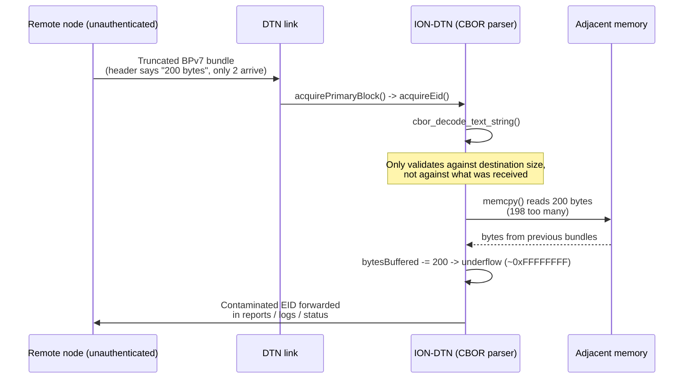

+++
date = '2026-09-17T12:00:00+02:00'
draft = false
title = 'How I found a bug in the software NASA uses to talk to space'
description = "Writeup of an out-of-bounds read and unsigned integer underflow in NASA's ION-DTN CBOR decoder."
+++

I had been browsing NASA's public GitHub repositories out of curiosity when one project immediately stood out: ION-DTN, the reference implementation of Delay/Disruption Tolerant Networking. This is the software stack designed for environments where links are unreliable, latency is extreme, and packets may need to survive long interruptions before they arrive.

That alone made it interesting from a security perspective. A protocol built around packets arriving whenever they can, often under hostile conditions, is exactly the kind of place where parser mistakes tend to matter. So I started reading the code that handles data as soon as it arrives from the network.

ION-DTN has been used on the ISS since 2016, and ESA has also used it on OPS-SAT, which makes even small memory-safety bugs worth taking seriously.

## The protocol, in short

DTN moves data around in bundles. Each bundle has a header encoded in CBOR, a compact binary cousin of JSON, which carries metadata including the EID (Endpoint ID), effectively the source or destination address of the bundle. A typical example would look something like `dtn://node123/service`.

To read those fields, ION-DTN relies on its own CBOR decoder, written in C. That decoder runs on unauthenticated network input, which means it sits directly on the exposed path for any incoming bundle.

## The bug

The issue lives in the CBOR string decoders, `cbor_decode_text_string` and `cbor_decode_byte_string`, in `ici/library/cbor.c`. Their job is simple: read a length value from the encoded field, then copy that many bytes out of the input buffer.

The validation was incomplete. The code checked whether the claimed string length fit inside the destination buffer, but it did not check whether that many bytes had actually been received from the network.

That means a truncated bundle can lie about the length of a field. If the header says 200 bytes are coming but only 2 are actually present, `memcpy()` still tries to read 200 bytes. The missing 198 bytes come straight out of adjacent heap memory.

```c
if (stringLength > *size)
{
    return 0;
}

// Missing: check stringLength against the bytes actually available.

memcpy(value, *cursor, stringLength);
*bytesBuffered -= stringLength;
```

There is a second issue immediately after the out-of-bounds read. If `stringLength` is larger than `*bytesBuffered`, which is an unsigned counter, the subtraction does not become negative. It wraps to a huge value such as `0xFFFFFFFF`, after which later bounds checks become meaningless.

## Why it matters

This would already be serious in a normal parser, but it is worse here because the leaked bytes are not just random padding. The receive buffer is reused between bundles and not fully cleared, so adjacent memory may still contain data from earlier traffic handled by the same node.

Those bytes can then become part of the decoded EID. ION stores that value and later reuses it in status reports, administrative traffic, and other protocol responses, effectively sending the leaked data back over the link without the attacker needing a second primitive.

In other words, the parsing bug can become a memory disclosure across the protocol itself. In constrained environments such as satellites or the ISS, where hardening features and patch cycles can be limited, that is not the kind of bug you want in the first stage of message handling.

## The flow, visually



## How I proved it

I did not need a full ION deployment to verify the issue. Instead, I wrote small C harnesses that link directly against the unmodified `cbor.c` file from ION-DTN and feed it a hand-crafted truncated bundle. Compiling with AddressSanitizer makes the failure obvious the moment the decoder reads beyond the provided buffer.

```bash
gcc -fsanitize=address -g harness_eid_path.c ION-DTN/ici/library/cbor.c -o harness
./harness
```

The result was immediate:

```text
==2988==ERROR: AddressSanitizer: heap-buffer-overflow
READ of size 200 at 0x502000000018
    #0 memcpy
    #1 cbor_decode_text_string  cbor.c:839
```

That is an out-of-bounds read on the real, unmodified NASA codebase, landing directly on the vulnerable `memcpy()` path.

## The fix

The fix is straightforward: validate the claimed string length against the number of bytes still available in the input buffer before copying anything.

```c
if (stringLength > *bytesBuffered)
{
    return 0;
}
```

## Outcome

I reported the issue through NASA's Vulnerability Disclosure Program on Bugcrowd. The finding was confirmed, fixed upstream, and closed as resolved.

You can read the public disclosure here: [Out-of-Bounds Read + Unsigned Integer Underflow in NASA ION-DTN CBOR string decoders](https://bugcrowd.com/disclosures/2c90b109-5bd5-4092-979f-7c4708a54543/out-of-bounds-read-unsigned-integer-underflow-in-nasa-ion-dtn-cbor-string-decoders-ici-library-cbor-c-839-777).